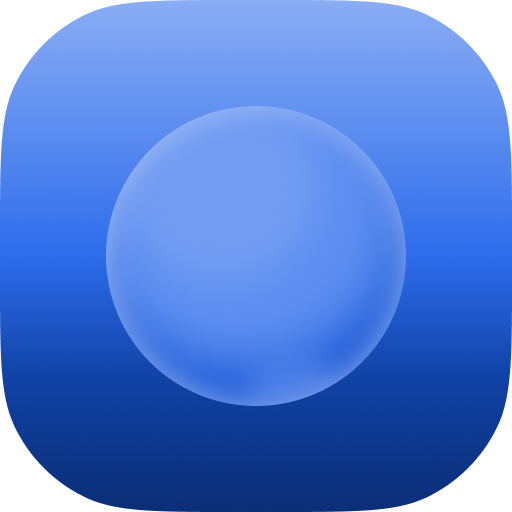

# Log Horizon

A beautifully minimalist, distraction-free daily log and journaling app for your desktop.

## What it does

**Log Horizon** is a lightweight desktop application built with Tauri, React, and TypeScript. It provides a serene, focused environment for writing your daily logs, thoughts, or notes. With its clean interface and hidden complexities, you can focus purely on writing without being distracted by cluttered UI elements.

## Features

- **Distraction-Free Editor:** A clean, borderless writing area that lets you focus on your words.
- **Collapsible Sidebar:** Hide the sidebar for a completely immersive, full-screen writing experience.
- **Auto-Saving:** Never lose your thoughts. Your entries are saved automatically as you type.
- **Real-time Stats:** Keep track of your writing with live word count, character count, and cursor position (Line/Col) in the status bar.
- **Theming:** Beautiful Light and Dark modes out-of-the-box, crafted with the soothing Catppuccin color palette.
- **Fast & Native:** Built on Tauri, ensuring a lightweight footprint and blazing-fast native desktop performance.

## Tech Stack

- **Frontend:** React, TypeScript, Tailwind CSS, Vite
- **Backend/Desktop:** Rust, Tauri
